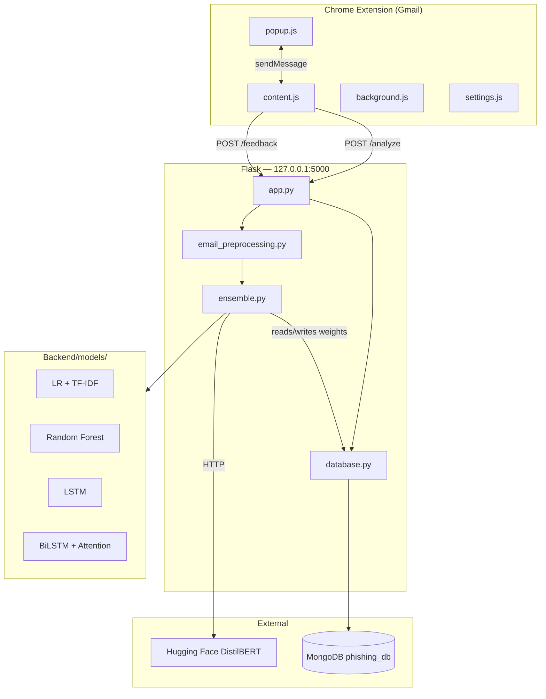
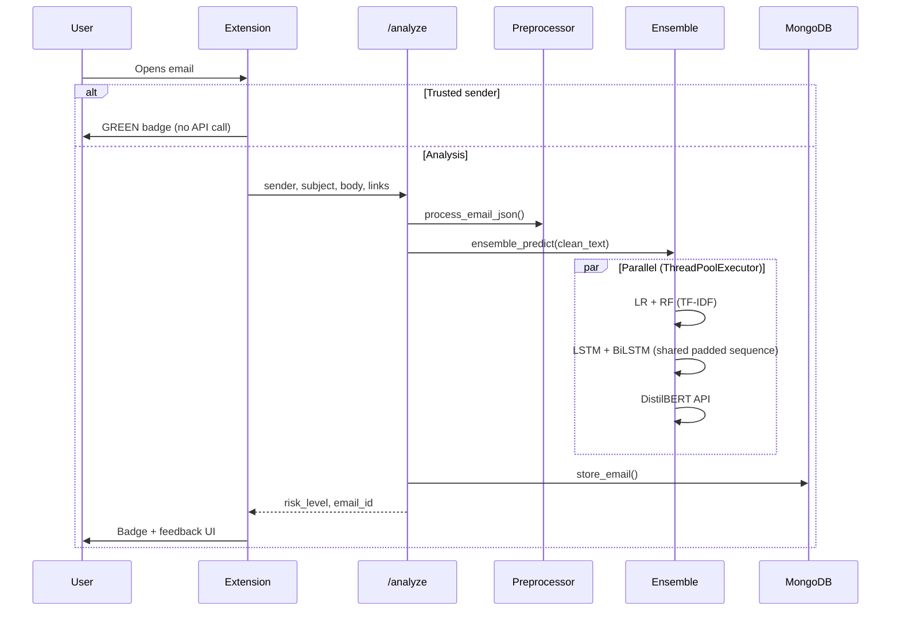
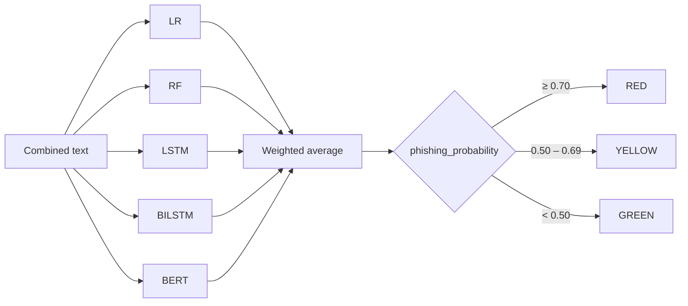

<div align="center">

# PhishGuard

**AI-powered phishing email detection for Gmail — real-time ensemble ML in a Chrome extension.**

[](https://www.python.org/)
[](https://flask.palletsprojects.com/)
[](https://www.tensorflow.org/)
[](https://developer.chrome.com/docs/extensions/)
[](https://www.mongodb.com/)
[](LICENSE)

**Hybrid Ensemble · Chrome Extension · Flask REST API · Hugging Face · MongoDB**

**[Live Demo — Model Info & Evaluation →](https://phishguard-web-six.vercel.app/)**

[Overview](#overview) · [Features](#features) · [Architecture](#architecture) · [Installation](#installation) · [Usage](#usage) · [API Reference](#api-reference)

</div>

---

## Overview

PhishGuard analyzes Gmail messages in real time. A Chrome extension extracts email content, sends it to a local **Flask** API, and scores it with a **weighted ensemble of five models** — classical ML, recurrent networks, and **DistilBERT** via the Hugging Face Inference API.

Results surface inline in Gmail as a color-coded badge (`GREEN` · `YELLOW` · `RED`) and in the extension popup with a risk gauge, trusted-sender bypass, HTML security reports, and optional user feedback.

## Why PhishGuard?

Phishing emails blend social engineering with subtle technical signals — urgent language, spoofed senders, obfuscated links, and HTML tricks that evade simple filters. No single model captures all of this reliably.

PhishGuard uses a **hybrid ensemble** by design:

- **Classical ML** (Logistic Regression, Random Forest) handles sparse TF-IDF patterns efficiently.
- **Sequence models** (LSTM, BiLSTM + Attention) capture word order and local context.
- **DistilBERT** adds transformer-level semantic understanding via the Hugging Face API.

Predictions run **in parallel**, are combined with configurable weights, and map to a three-tier risk score users can act on immediately.

## Repository at a Glance

| | |
| --- | --- |
| **Models** | 5 — Logistic Regression, Random Forest, LSTM, BiLSTM + Attention, DistilBERT |
| **Backend** | Flask (`127.0.0.1:5000`) |
| **Database** | MongoDB — `phishing_db` |
| **Extension** | Chrome Manifest V3 · Gmail (`mail.google.com`) |
| **Inference** | Parallel pipeline — `ThreadPoolExecutor` (4 workers) |
| **API endpoints** | `POST /analyze`, `POST /feedback` |

> Dataset size and cloud deployment details are not defined in this repository. Model evaluation metrics are on the [live demo site](https://phishguard-web-six.vercel.app/).

---

## Visual Preview

| Architecture | Gmail badge | Extension popup | Demo |
| :---: | :---: | :---: | :---: |
|  |  |  |  |

---

## Features

| Capability | Description |
| --- | --- |
| Real-time Gmail scanning | DOM observation with debounced extraction when an email is opened |
| 5-model ensemble | LR, RF, LSTM, BiLSTM + Attention, DistilBERT (HF API) |
| Parallel inference | Four concurrent tasks via `ThreadPoolExecutor` (4 workers) |
| Three-tier risk UI | `GREEN` / `YELLOW` / `RED` with probability and recommended action |
| Trusted senders | Full addresses or `*@domain.com` wildcards bypass the backend |
| User feedback | Clickable Gmail badge submits labels to `POST /feedback` |
| MongoDB persistence | Analysis records, per-model outputs, and ensemble weights |
| Security reports | Popup exports a styled HTML report |
| Consent-gated activation | Scanning starts only after `userConsent` is set during onboarding |

---

## Architecture

### System overview



### Request flow



### Ensemble & risk mapping



Default weights (`lr` 0.25 · `rf` 0.15 · `lstm` 0.10 · `bilstm` 0.15 · `bert` 0.35) are stored in MongoDB (`system_state.ensemble_weights`) and snapshotted on each analysis.

---

## Tech Stack

<table>
<tr>
<td width="50%" valign="top">

**Frontend**

- Chrome Extension Manifest V3
- Vanilla JavaScript
- `chrome.storage` (local + session)
- Content scripts on Gmail

</td>
<td width="50%" valign="top">

**Backend**

- Python · Flask · Flask-CORS
- `ThreadPoolExecutor` (4 workers)
- `python-dotenv`

</td>
</tr>
<tr>
<td valign="top">

**Machine Learning**

- scikit-learn models via joblib
- TensorFlow / Keras (LSTM, BiLSTM + Attention)
- DistilBERT — [HF Inference API](https://huggingface.co/cybersectony/phishing-email-detection-distilbert_v2.4.1)

</td>
<td valign="top">

**Data & Parsing**

- MongoDB (`pymongo`) — `phishing_db`
- BeautifulSoup4 · regex · `urllib.parse`

</td>
</tr>
</table>

---

## Project Structure

```
PhishGuard/
├── Backend/
│   ├── app.py
│   ├── ensemble.py
│   ├── email_preprocessing.py
│   ├── database.py
│   ├── requirements.txt
│   └── .env                    # create this — not committed
│
├── Extension (Frontend)/
│   ├── manifest.json
│   ├── content.js
│   ├── background.js
│   ├── popup.html / popup.js / popup.css
│   ├── settings.html / settings.js / settings.css
│   └── onboarding.html / onboarding.js / onboarding.css
│
├── Models/                     # trained artifacts committed here
│   ├── logistic_model.pkl
│   ├── random_forest_model.pkl
│   ├── tfidf_vectorizer.pkl
│   ├── lstm_phishing_model.keras
│   ├── tokenizer.pkl
│   └── bilstm_attn_model.h5
│
├── docs/assets/                # README image placeholders
├── .gitignore
├── LICENSE
└── README.md
```

The backend (`ensemble.py`) loads models from `Backend/models/`. Before starting the API, copy the artifacts from the repo's `Models/` directory into that path (see [Installation](#installation)).

---

## Installation

### Prerequisites

- Python 3 with `venv`
- Google Chrome
- MongoDB instance (connection string via `MONGO_URL`)
- Hugging Face API token

### 1. Clone

```bash
git clone https://github.com/mak3012/PhishGuard.git
cd PhishGuard
```

### 2. Copy model artifacts

`ensemble.py` resolves model paths relative to `Backend/models/`. The trained files are committed at `Models/` (repo root); copy them before starting the API.

**Windows (PowerShell):**

```powershell
New-Item -ItemType Directory -Force Backend\models
Copy-Item Models\* Backend\models\
```

**macOS / Linux:**

```bash
mkdir -p Backend/models
cp Models/* Backend/models/
```

### 3. Backend environment

```bash
cd Backend
python -m venv venv
```

**Windows (PowerShell):**

```powershell
.\venv\Scripts\Activate.ps1
```

**macOS / Linux:**

```bash
source venv/bin/activate
```

```bash
pip install -r requirements.txt
```

### 4. Environment variables

Create `Backend/.env`:

```env
HF_TOKEN=your_huggingface_api_token
BERT_API_URL=https://router.huggingface.co/hf-inference/models/cybersectony/phishing-email-detection-distilbert_v2.4.1
MONGO_URL=mongodb+srv://<user>:<password>@<cluster>.mongodb.net/phishing_db?retryWrites=true&w=majority
```

| Variable | Purpose |
| --- | --- |
| `HF_TOKEN` | Hugging Face Inference API bearer token |
| `BERT_API_URL` | DistilBERT endpoint |
| `MONGO_URL` | MongoDB connection string |

### 5. Run the API

```bash
python app.py
```

Listens at **http://127.0.0.1:5000**.

### 6. Load the extension

1. Open `chrome://extensions`
2. Enable **Developer mode**
3. **Load unpacked** → select `Extension (Frontend)`
4. Complete onboarding and refresh Gmail tabs

---

## Usage

**Auto-scan** — With the backend running and onboarding complete, opening a Gmail message triggers analysis. A badge appears next to the subject: `SCANNING` → `SAFE` / `SUSPICIOUS` / `PHISHING`.

**Popup** — Toolbar icon shows the risk gauge, sender, link count, **Re-Scan**, **Report** download, and **Model Info** link.

**Trusted senders** — Settings accepts `user@example.com` or `*@domain.com`. Trusted messages are marked safe locally without calling the API.

**Feedback** — Click the Gmail badge to label an email `legitimate_email` or `phishing_email`. Sent to `POST /feedback` and stored on the MongoDB record.

---

## API Reference

### `POST /analyze`

**Request:**

```json
{
  "sender": "sender@example.com",
  "subject": "Account verification required",
  "body": { "html": "<p>...</p>", "text": "..." },
  "links": [{ "url": "https://example.com", "text": "Click here" }]
}
```

**Response:**

```json
{
  "email_id": "...",
  "risk_level": "YELLOW",
  "phishing_probability": 0.62,
  "confidence": 0.62,
  "explanation": "This might be a phishing email",
  "details": { "color": "#f1c40f", "action": "review" }
}
```

Also accepts `OPTIONS` (CORS preflight).

### `POST /feedback`

**Request:**

```json
{
  "email_id": "...",
  "true_label": "phishing_email"
}
```

`true_label`: `legitimate_email` or `phishing_email`.

**Response:**

```json
{
  "message": "Feedback recorded",
  "updated_weights": { "lr": 0.25, "rf": 0.15, "lstm": 0.10, "bilstm": 0.15, "bert": 0.35 }
}
```

---

## Models

| Model | Input | Default weight |
| --- | --- | --- |
| Logistic Regression | TF-IDF vectors | 0.25 |
| Random Forest | TF-IDF vectors | 0.15 |
| LSTM | Tokenized sequence (max 100) | 0.10 |
| BiLSTM + Attention | Tokenized sequence + custom attention layer | 0.15 |
| DistilBERT | HF API (text truncated to 2000 chars) | 0.35 |

DistilBERT outputs are normalized from labels such as `legitimate_email`, `legitimate_url`, `phishing_url`, and `phishing_url_alt` into binary probabilities.

### Risk thresholds

| Phishing probability | Level | Action |
| --- | --- | --- |
| ≥ 0.70 | `RED` | block |
| 0.50 – 0.69 | `YELLOW` | review |
| < 0.50 | `GREEN` | allow |

### Preprocessing

`process_email_json()` builds model input:

1. Strip HTML tags (`script`, `style`, `noscript`, `iframe`, `svg`)
2. Extract visible text (fallback: plain `body.text`)
3. Collect URLs from the links array
4. Compute URL and image heuristics (`url_features`, `image_features`)
5. Assemble `clean_text`: sender, subject, body, and link URLs

Ensemble models score `clean_text` only.

---

## MongoDB Schema

**Database:** `phishing_db`

| Collection | Purpose |
| --- | --- |
| `emails` | Analysis records and user feedback |
| `system_state` | Ensemble weights (`_id: "ensemble_weights"`) |

**`emails` fields:** `sender`, `subject`, `clean_text` (first 500 chars), `final_prediction`, `final_confidence`, `phishing_probability`, `risk_level`, `model_outputs`, `feedback`, `weights_used`, `timestamp`

---

## Engineering Highlights

| Pattern | Implementation |
| --- | --- |
| Parallel scoring | LR/RF, LSTM, BiLSTM, BERT dispatched concurrently via `ThreadPoolExecutor(max_workers=4)` |
| Shared tokenization | Padded sequence computed once and reused by both LSTM and BiLSTM |
| Local + remote inference | Classical/RNN models load from disk; DistilBERT runs via HF Inference API |
| Debounced extraction | 500 ms delay + HTML fingerprint check in `content.js` before re-analysis |
| Trusted-sender bypass | Skips API call entirely for configured senders; result is local only |
| Weight persistence | Default weights seeded to MongoDB `system_state` on first backend start |
| Custom attention layer | `AttentionLayer` (Keras `Layer` subclass) loaded with `custom_objects` for BiLSTM |

Evaluation metrics are on the [live demo site](https://phishguard-web-six.vercel.app/).

---

## My Contributions

**Ayush Makade** ([@mak3012](https://github.com/mak3012))

- Designed and implemented the HTML-aware email preprocessing pipeline — extracting visible text from raw HTML via BeautifulSoup, engineering URL and image heuristics, and assembling the `clean_text` representation consumed by all five ensemble models.
- Built and integrated the Flask REST API, connecting the preprocessing layer to the ensemble inference pipeline and handling real-time communication with the Chrome extension across `POST /analyze` and `POST /feedback`.
- Integrated the hybrid ensemble inference pipeline, combining Logistic Regression, Random Forest, LSTM, BiLSTM + Attention, and DistilBERT into a unified parallel scoring workflow with MongoDB-backed configurable weighted averaging.
- Authored all technical documentation — system architecture diagrams, API reference, preprocessing specification, and installation guides — structured to serve both recruiters and engineers onboarding to the project.
- Prepared and published the portfolio version of the repository: organized the project structure, added `requirements.txt`, `LICENSE`, and `.gitignore`, and released the codebase on GitHub.

---

## Authors

- **Savio David**
- **Aaron Coutinho**
- **Deyon Tomy**
- **Ayush Makade**

Developed as part of an academic research project on phishing detection using ensemble machine learning techniques.

---

## License

[MIT License](LICENSE) — developed primarily for academic and research purposes.

---

<div align="center">

**[⬆ Back to top](#phishguard)**

</div>
